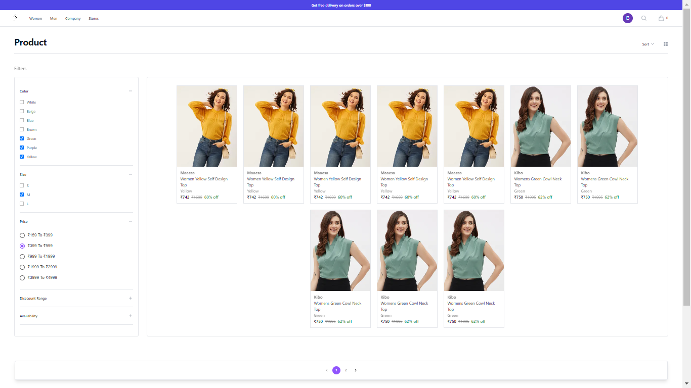
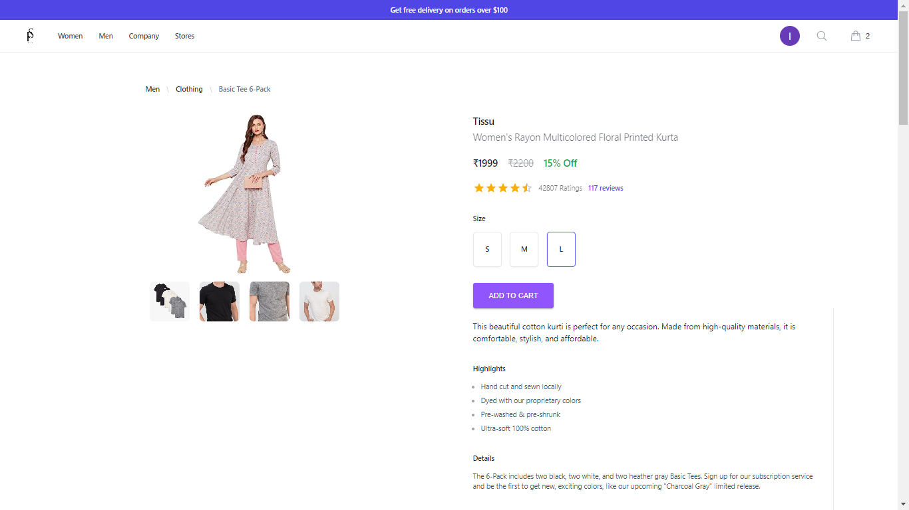
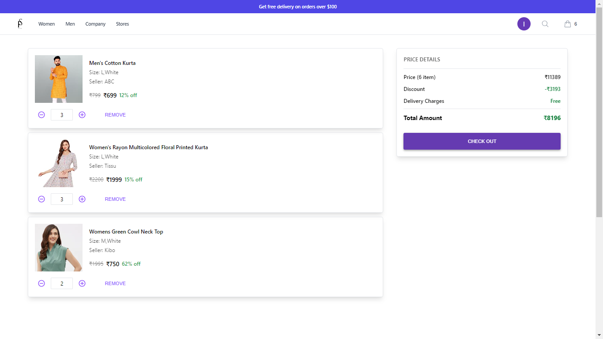
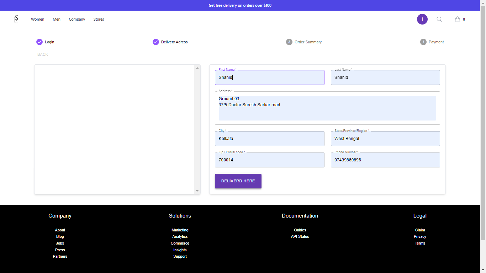
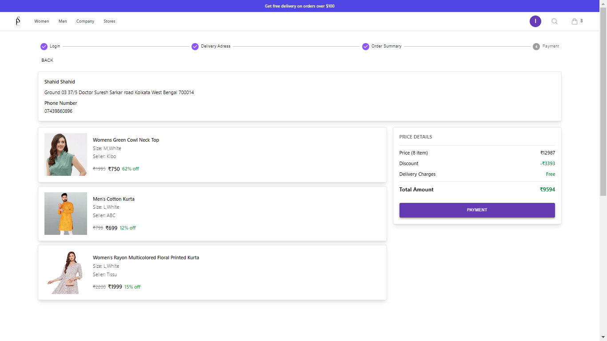
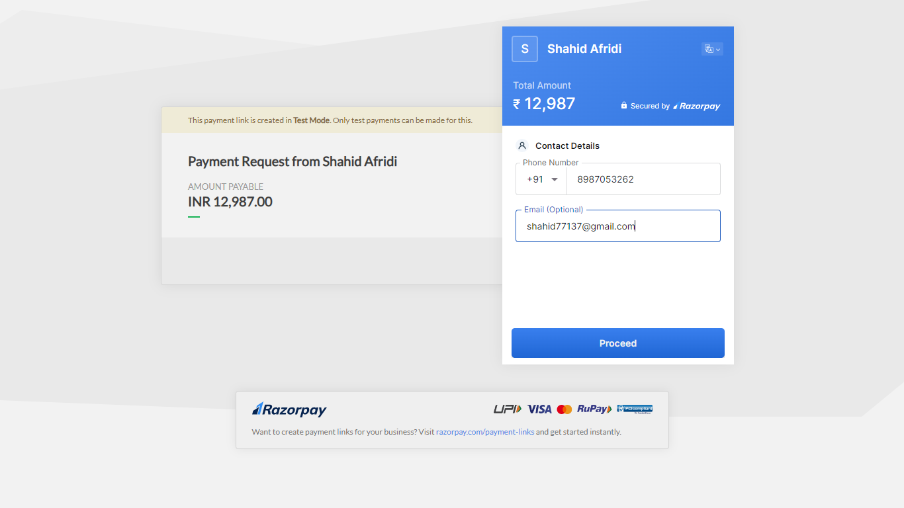
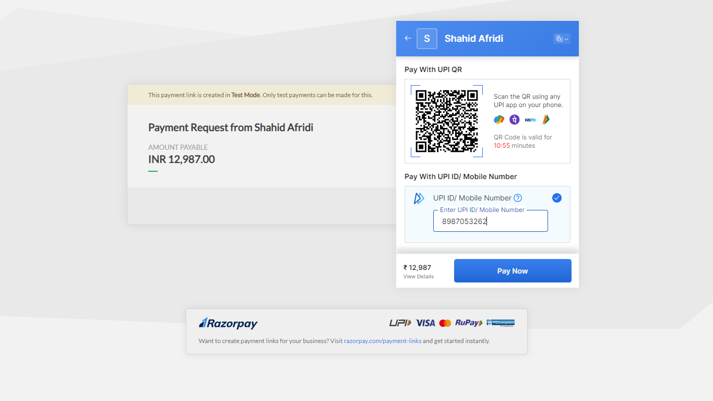

# E-Commerce-Project

## **WEB SERVICE : RESTFUL A.P.I.**

The Spring Boot-based e-commerce API is a robust solution that adheres to the principles of RESTful architecture while prioritizing scalability and seamless integration. Its standout feature lies in its comprehensive image management capabilities, encompassing the uploading, serving, and deletion of images across various entities such as customers, products, reviews, and feedback. This functionality ensures efficient space management on both the server and client sides, enhancing overall performance.

Security is a top priority, as the API leverages Spring Security and JSON Web Tokens (JWT) to facilitate secure user authentication and role-based access control. This guarantees that only authorized users can access sensitive data and perform permitted actions. Furthermore, the incorporation of Hibernate Validator enforces data integrity and constraints across all HTTP requests and payloads, maintaining the validity and consistency of data throughout the application. Custom validation exceptions enhance error handling and user feedback.

The API's modular architecture promotes adaptability and ease of development, seamlessly connecting entities and Data Transfer Objects (DTOs). This mechanism streamlines the creation of custom DTOs for HTTP requests and responses, ensuring a standardized and user-friendly experience. Hypermedia links, facilitated by the Spring Hypermedia as the Engine of Application State (HATEOAS) library, enhance user navigation and accessibility.

Additional functionalities, including pagination, filtering, sorting, and searching, contribute to efficient data handling and retrieval. The provision of self, collections, and paging hypermedia links further improves user interaction and workflow. To simplify management, the API generates an admin interface that allows for easy oversight and control of the e-commerce platform.

In conclusion, this e-commerce API offers a sophisticated solution for integrating e-commerce functionality into applications. Its balanced focus on performance, security, and user-friendliness makes it a versatile choice for developers seeking to enhance existing applications or businesses aiming to establish a powerful and customizable e-commerce platform.

## Introduction
FemSha is an e-commerce website specializing in fashion products. Whether you're looking for the latest trends in clothing or accessories, we've got you covered. Our platform is designed to provide an intuitive and enjoyable shopping experience for all users.

# FemSha E-commerce Website Logo

  

# Shop With FemSha

### website
https://femsha-shop-website.vercel.app/

### server spring boot
https://github.com/Shahid77137/E-Commerce-Project

## Tech Stack

- JAVA
- SPRING
- SPRINGBOOT
- SPRING SECURITY
- HIBERNATE
- MAVEN
- MYSQL
- POSTMAN
- REACT JS
- TAILWIND CSS
- VERCEL

## Dependencies

- JWT AUTHENTICATION
- SPRING SECURITY
- SPRING DATA JPA
- SPRING BOOT DEVTOOLS
- SPRING WEB
- HIBERNATE
- MYSQL DRIVER
- VALIDATION
- LOMBOK
- MODEL MAPPER
- MATERIAL UI
- MATERIAL UI ICONS
- REACT ALICE CAROUSEL
- HEADLESS UI/REACT
- HEROICONS/REACT
- TAILWIND CSS

## Features

- **RESTful API Design** : Adheres to REST architectural principles, providing a set of CRUD endpoints accessible via standard HTTP methods (GET, POST, PUT, DELETE).
- **Modular Architecture** : Designed with well-defined modules, facilitating clear separation of concerns for easier maintenance and scalability.

- **Human-Readable URIs** : Uses user-friendly URIs for improved usability.

- **Image Handling** : Supports image upload and retrieval for customers, products, reviews, and feedback.

- **Data Mapping** : Employs object mapping to enable data exchange between client and server through mapping entities to transfer objects.

- **Hypermedia Navigation** : Integrates Spring HateOAS for facilitating user navigation through the provision of hypermedia links.

- **Data Retrieval** : Includes functionality for pagination, filtering, sorting, and searching for products, reviews, and feedback.

- **Efficient Data Transfer** : Uses optimized transfer objects to enhance performance in both HTTP requests and responses.

- **JSON API Responses** : Returns all requests in a JSON format, ensuring consistent data representation.

- **Customized Exception Handling** : Implements customized exception handling for improved user experience and error messaging.

- **Request Body Validation** : Implements request body data validation to ensure data accuracy and security.

- **Token-Based Auth and Authorization** : Enables authentication and authorization through the use of JSON Web Tokens (JWT) with Spring Security.

- **Role-Based Access Control** : Implements role-specific access control to restrict resource access to authorized users.

- **Security Measures** : Incorporates security measures such as JWT token expiration after 20 minutes and restricted admin registration to maintain system security.

- **Database Administration** : Provides administration tools for managing the database.

- **Product Categorization** : Implements product categorization for improved browsing experience.

- **Product Filtering** : Allows customers to view products based on the tag "Customer's Best Choice" and products on discount sale.

- **Order Management System** : Offers a platform for customers to place, view, cancel orders, make payments, and track order status including delivery, pickup, return, and replacement.

- **Payment Method Management** : Allows administrators to add, revoke, and manage available payment methods.

- **Sales and Revenue Reporting** : Enables generation and viewing of sales and revenue reports including top-selling and least-selling products, highest sold products by rating and price, and sales made in different time periods.

---
## ER Diagram

---

&nbsp;&nbsp;&nbsp;&nbsp;&nbsp;&nbsp;&nbsp;&nbsp;&nbsp;&nbsp;&nbsp;&nbsp;&nbsp;&nbsp;&nbsp;&nbsp;&nbsp;&nbsp;&nbsp;&nbsp;&nbsp;&nbsp;&nbsp;&nbsp;&nbsp;&nbsp;&nbsp;&nbsp;&nbsp;&nbsp;&nbsp;&nbsp;&nbsp;&nbsp;&nbsp;&nbsp;&nbsp;&nbsp;&nbsp;&nbsp;&nbsp;&nbsp;&nbsp;&nbsp;&nbsp;&nbsp;&nbsp;&nbsp;&nbsp;&nbsp;&nbsp;&nbsp;&nbsp;&nbsp;&nbsp;&nbsp;&nbsp;&nbsp;&nbsp;&nbsp;&nbsp;&nbsp;&nbsp;&nbsp;&nbsp;&nbsp;&nbsp;&nbsp;&nbsp;&nbsp;&nbsp;&nbsp;&nbsp;&nbsp;&nbsp;&nbsp;&nbsp;&nbsp;&nbsp;&nbsp;&nbsp;&nbsp;&nbsp;Home Page

---

---

&nbsp;&nbsp;&nbsp;&nbsp;&nbsp;&nbsp;&nbsp;&nbsp;&nbsp;&nbsp;&nbsp;&nbsp;&nbsp;&nbsp;&nbsp;&nbsp;&nbsp;&nbsp;&nbsp;&nbsp;&nbsp;&nbsp;&nbsp;&nbsp;&nbsp;&nbsp;&nbsp;All Product Page&nbsp;&nbsp;&nbsp;&nbsp;&nbsp;&nbsp;&nbsp;&nbsp;&nbsp;&nbsp;&nbsp;&nbsp;&nbsp;&nbsp;&nbsp;&nbsp;&nbsp;&nbsp;&nbsp;&nbsp;&nbsp;&nbsp;&nbsp;&nbsp;&nbsp;&nbsp;&nbsp;&nbsp;&nbsp;&nbsp;&nbsp;&nbsp;&nbsp;&nbsp;&nbsp;&nbsp;&nbsp;&nbsp;&nbsp;&nbsp;&nbsp;&nbsp;&nbsp;&nbsp;&nbsp;&nbsp;&nbsp;&nbsp;&nbsp;&nbsp;&nbsp;&nbsp;&nbsp;&nbsp;&nbsp;&nbsp;&nbsp;&nbsp;&nbsp;&nbsp;&nbsp;&nbsp;Product Page

---

  
  

---

&nbsp;&nbsp;&nbsp;&nbsp;&nbsp;&nbsp;&nbsp;&nbsp;&nbsp;&nbsp;&nbsp;&nbsp;&nbsp;&nbsp;&nbsp;&nbsp;&nbsp;&nbsp;&nbsp;&nbsp;Cart Page&nbsp;&nbsp;&nbsp;&nbsp;&nbsp;&nbsp;&nbsp;&nbsp;&nbsp;&nbsp;&nbsp;&nbsp;&nbsp;&nbsp;&nbsp;&nbsp;&nbsp;&nbsp;&nbsp;&nbsp;&nbsp;&nbsp;&nbsp;&nbsp;&nbsp;&nbsp;&nbsp;&nbsp;&nbsp;&nbsp;&nbsp;&nbsp;&nbsp;&nbsp;&nbsp;&nbsp;&nbsp;&nbsp;&nbsp;&nbsp;Delivery Address Page&nbsp;&nbsp;&nbsp;&nbsp;&nbsp;&nbsp;&nbsp;&nbsp;&nbsp;&nbsp;&nbsp;&nbsp;&nbsp;&nbsp;&nbsp;&nbsp;&nbsp;&nbsp;&nbsp;&nbsp;&nbsp;&nbsp;&nbsp;&nbsp;&nbsp;&nbsp;&nbsp;Order Summary Page

---

  
  
  

---

&nbsp;&nbsp;&nbsp;&nbsp;&nbsp;&nbsp;&nbsp;&nbsp;&nbsp;&nbsp;&nbsp;&nbsp;&nbsp;&nbsp;&nbsp;&nbsp;&nbsp;&nbsp;&nbsp;&nbsp;&nbsp;&nbsp;&nbsp;&nbsp;&nbsp;&nbsp;&nbsp;Payment Verification&nbsp;&nbsp;&nbsp;&nbsp;&nbsp;&nbsp;&nbsp;&nbsp;&nbsp;&nbsp;&nbsp;&nbsp;&nbsp;&nbsp;&nbsp;&nbsp;&nbsp;&nbsp;&nbsp;&nbsp;&nbsp;&nbsp;&nbsp;&nbsp;&nbsp;&nbsp;&nbsp;&nbsp;&nbsp;&nbsp;&nbsp;&nbsp;&nbsp;&nbsp;&nbsp;&nbsp;&nbsp;&nbsp;&nbsp;&nbsp;&nbsp;&nbsp;&nbsp;&nbsp;&nbsp;&nbsp;&nbsp;&nbsp;&nbsp;&nbsp;&nbsp;&nbsp;&nbsp;&nbsp;&nbsp;&nbsp;&nbsp;Payment Method

---

  
  
  

---

&nbsp;&nbsp;&nbsp;&nbsp;&nbsp;&nbsp;&nbsp;&nbsp;&nbsp;&nbsp;&nbsp;&nbsp;&nbsp;&nbsp;&nbsp;&nbsp;&nbsp;&nbsp;&nbsp;&nbsp;&nbsp;&nbsp;&nbsp;&nbsp;&nbsp;&nbsp;&nbsp;&nbsp;&nbsp;&nbsp;&nbsp;&nbsp;&nbsp;&nbsp;&nbsp;&nbsp;&nbsp;&nbsp;&nbsp;&nbsp;&nbsp;&nbsp;&nbsp;&nbsp;&nbsp;&nbsp;&nbsp;&nbsp;&nbsp;&nbsp;&nbsp;&nbsp;&nbsp;&nbsp;&nbsp;&nbsp;&nbsp;&nbsp;&nbsp;&nbsp;&nbsp;&nbsp;&nbsp;&nbsp;&nbsp;&nbsp;&nbsp;&nbsp;&nbsp;&nbsp;&nbsp;&nbsp;&nbsp;Payment Success Page

---

---

## 🌟Feedback
Your valuable feedback is greatly appreciated. You can reach out to me via below medium

- [Shahid](https://shahid77137.github.io/)

---

## 📝 Acknowledgements
- [Masai School](https://www.masaischool.com/)
---

<h1 align="center">THANK YOU FOR VISITING Our Website</h1>

